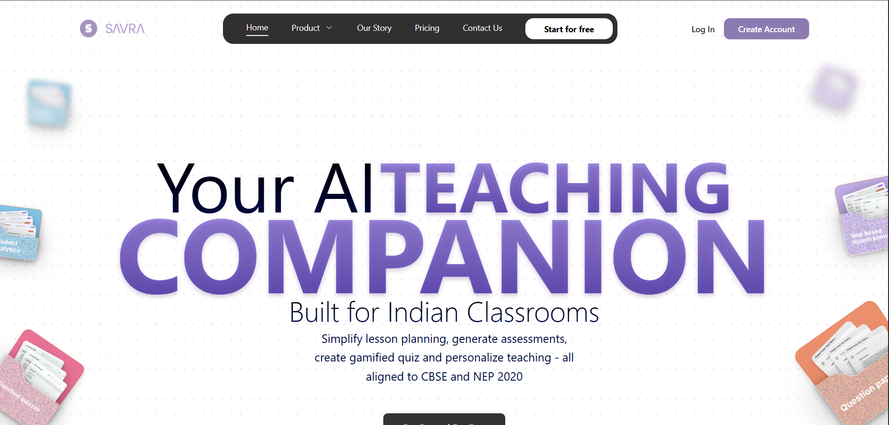
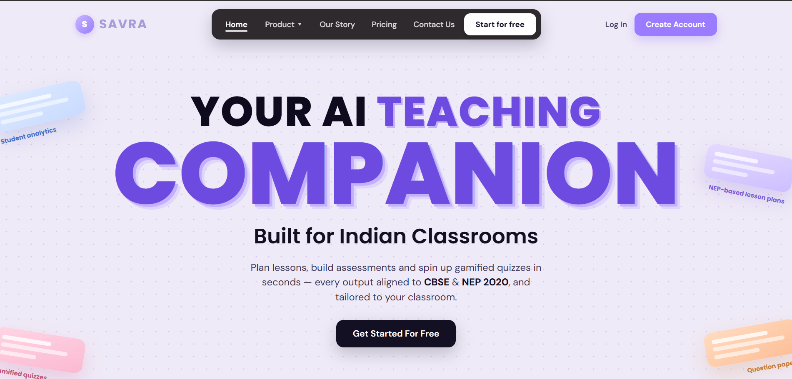
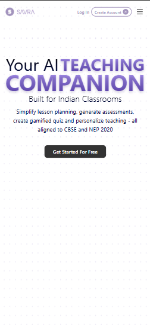
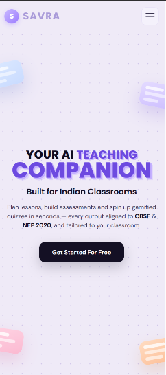

# Savra - Hero & Mobile Nav Rebuild

A responsive rebuild of the hero section and mobile navigation for [Savra](https://www.savraedu.com/), an AI teaching companion built for Indian classrooms.

**Live demo:** https://savra-hero-section.vercel.app/
**Stack:** Next.js · Tailwind CSS

---

## Overview

The original landing page looked sharp on desktop, but the layout was built desktop-first and the mobile breakpoints weren't fully finished. That surfaced as a few visible issues on smaller screens: the hero overflowed the viewport, the mobile menu shoved the page around when opened, and the decorative SVG tags didn't scale.

This is a focused rebuild of just the hero and navigation, matching the existing Next.js + Tailwind stack so it can slot straight into the current codebase.

---

## What changed

### 1. Hero typography - overflow and a large empty gap

**Problem:** The heading used a fixed font size, so on narrow screens the words ran past the edges of the viewport. A fixed-height container also reserved desktop-sized space, leaving a big empty gap below the hero on mobile.

**Before**
```jsx
// Fixed size overflowed small screens; fixed height left a gap underneath
<h1 className="text-[8rem] leading-none">
  Your AI Teaching Companion
</h1>
```

**After**
```jsx
// Fluid type via clamp(): readable floor, viewport-relative middle, desktop ceiling.
// The two lines scale independently, so nothing overflows on narrow screens.
<h1 className="uppercase font-extrabold leading-[0.96]">
  <span className="block whitespace-nowrap" style={{ fontSize: "clamp(28px,6.2vw,80px)" }}>
    Your AI <span style={{ color: "#6D4AE0" }}>Teaching</span>
  </span>
  <span className="block" style={{ fontSize: "clamp(52px,12.5vw,168px)" }}>
    Companion
  </span>
</h1>
```

Each `clamp()` sets a readable floor, a viewport-relative middle, and a desktop ceiling, so the type resizes smoothly across every screen width instead of snapping between fixed breakpoints. The section itself uses `min-h-[calc(100vh-70px)]` with flex centering rather than a fixed height, so there's no reserved empty space below the hero on mobile.

---

### 2. Mobile navigation - menu pushed the hero down

**Problem:** The mobile menu rendered inside the normal document flow, so opening it pushed the entire hero section down the page instead of sitting on top of it.

**Before**
```jsx
// Menu sat in the document flow, so opening it displaced the page content
{isOpen && (
  <div className="w-full bg-white">
    {/* nav links */}
  </div>
)}
```

**After**
```jsx
// The drawer is an absolutely-positioned panel under a sticky, z-50 header.
// Being out of normal flow, toggling it never displaces the hero below.
<header className="sticky top-0 z-50 backdrop-blur-md">
  <nav>{/* logo, links, burger */}</nav>

  <div
    className={`absolute left-0 right-0 top-full overflow-y-auto
                backdrop-blur-md ${menuOpen ? "block" : "hidden"}`}
  >
    {/* nav links + Log In / Create Account */}
  </div>
</header>
```

Rendering the drawer as an `absolute` panel under a `sticky top-0 z-50` header takes it out of the document flow, so it overlays the page and the content underneath never shifts. Toggling `block` / `hidden` shows and hides it.

---

### 3. Floating tags - fixed-size SVGs that didn't scale

**Problem:** The decorative tags were SVGs with hardcoded pixel sizes and positions, so they didn't resize or reflow on smaller screens and collided with the hero text.

**Before**
```jsx
// Hardcoded px size and position; no scaling or reflow on mobile

```

**After**
```jsx
// Each tag is positioned with % offsets and sized with clamp(),
// so it tracks the layout instead of sitting at hardcoded pixels.
<div
  className="savra-card absolute"
  style={{ top: "12%", left: "-1%", width: "clamp(120px,15vw,180px)", transform: "rotate(-13deg)" }}
>
  {/* card body */}
  <div className="savra-card-lbl">Student analytics</div>
</div>
```

```css
/* On small screens the cards shrink and their labels drop away,
   so they never crowd the hero text. */
@media (max-width: 720px) {
  .savra-card     { width: 96px !important; }
  .savra-card-lbl { display: none !important; }
}
```

Percentage offsets and `clamp()` widths let the tags track the layout, while a small-screen media query shrinks the cards and hides their labels so they never collide with the hero text.

---

## Screenshots

| | Before | After |
|---|---|---|
| **Desktop** | [](./screenshots/desktop-before.png) | [](./screenshots/desktop-after.png) |
| **Mobile** | [](./screenshots/mobile-before.png) | [](./screenshots/mobile-after.png) |

---

## Run locally

```bash
git clone https://github.com/AbdulWasih05/savra-heroSection.git
cd savra-heroSection
npm install
npm run dev
```

Open http://localhost:3000 to view it.

---

Built by [Abdul Wasih](https://github.com/AbdulWasih05).
